# Learn Flutter
website: https://flutter.dev
docs: https://flutter.dev/docs


## Project Installation:
### 1. Building yourself

#### First Install flutter : [Flutter Installation](https://flutter.dev/docs/get-started/install)
```
$ git clone https://github.com/hemanta212/hello_flutter.git
$ cd hello_flutter
$ flutter upgrade
```

#### For each project you can navigate to folder and run
```
$ flutter pub get
$ flutter run
```

### 2. Install and try out apks!
Head over to the release page to try out the apps.
[APK Releases](https://github.com/hemanta212/hello_flutter/releases/tag/v0.0.2)

## Projects: (ORDER: Beginner ---> Advanced)
1. [Hello world](#hello) [Beginner]
2. [Lucky Number Generator](#lucky) [Beginner]
3. [Simple Interest Calculator](#si) [Beginner-Intermediate]
4. [Note Keeping Application](#notes) [Beginner-Advanced]
5. [Inventory Management App](#bk_app) [Intermediate]


### Hello world app in flutter <a id='hello'></a>
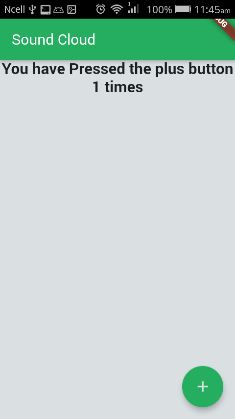  
 

### Lucky no generator <a id='lucky'></a>

 

### Simple interest calculator <a id='si'></a>
* Basic state management
* Connecting Dart logic and UI
* Basic Designing and Layout of Widgets
* Forms (input, validation, processing)

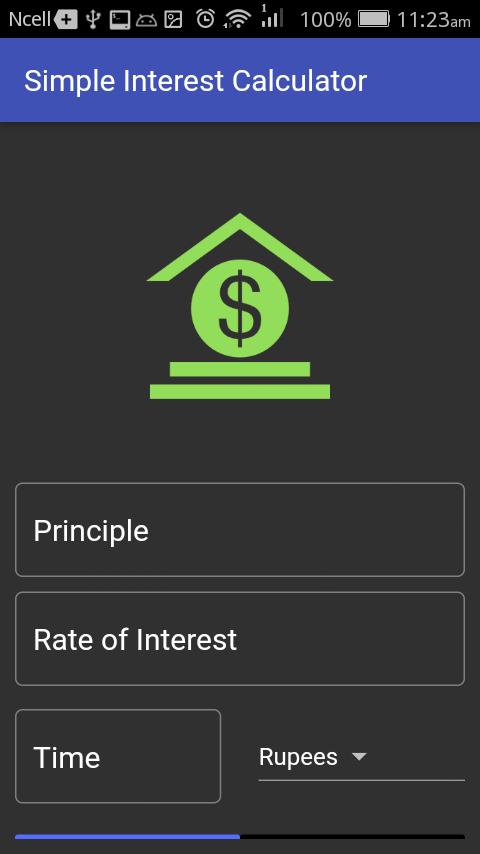 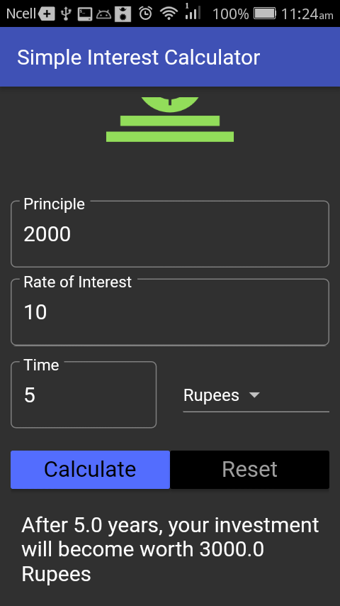
 
## A flutter Notekeeping app <a id='notes'></a>
* OOP concepts (Classes, named constructors, singletons)
* Async/Await (Asynchronous processes) in dart/flutter
* Sqflite db for CRUD operation, Intl for date formats & path_provider for accessing app data dirs in platform independent way
* Widgets like ListView builder, snackbar, alertDialogs, Icons, Cards, GestureDetector
* Passing of context data, Navigation between screens

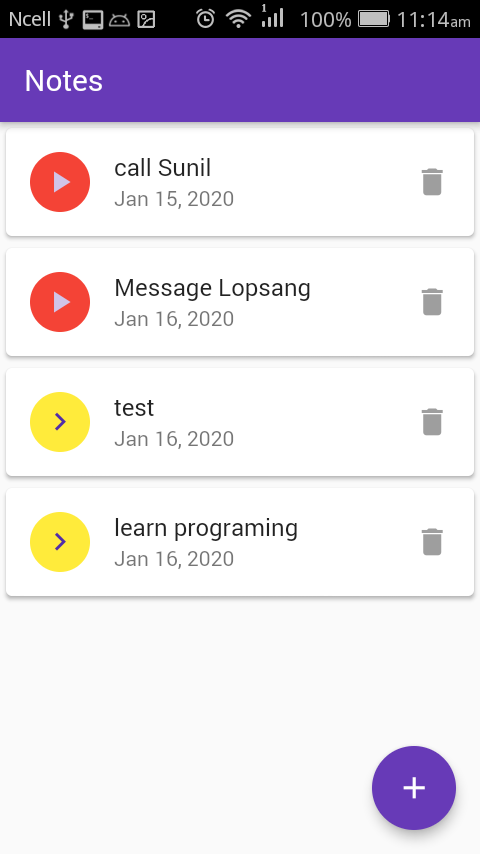 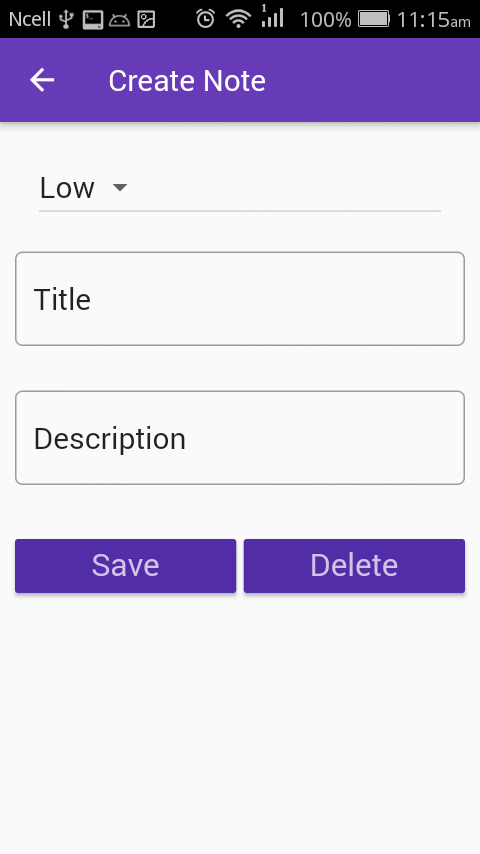 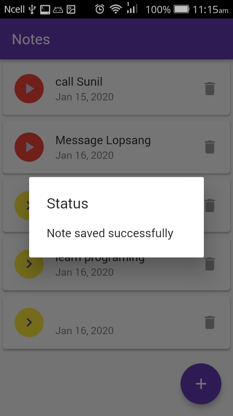
 
 
## Inventory Management App <a id='bk_app'></a> [Repository](https://github.com/hemanta212/inventory_app) [Download APK](https://github.com/hemanta212/inventory_app/releases/latest)
* Advanced state management solutions like provider,
* Use of singleton objects for caching and accessing the instance throughout the code.
* Implementation of Navigation Drawers, tabs, search bars, autocompletion and fuzzy like search algorithms.
* Use of Streams for live UI updates, Datatables for better data view, routes for screens.
* Using batches for failproof db operations, Role base db modifications.
* Testing in flutter application.
* Data Export/Import from CSV dumps.
* Online and Offline No SQL data storage with firebase's cloud_firestore.
* Integration of Authentication like google signin, email authentication with firebase_auth.
* Continuous integration for streamlined devflow.

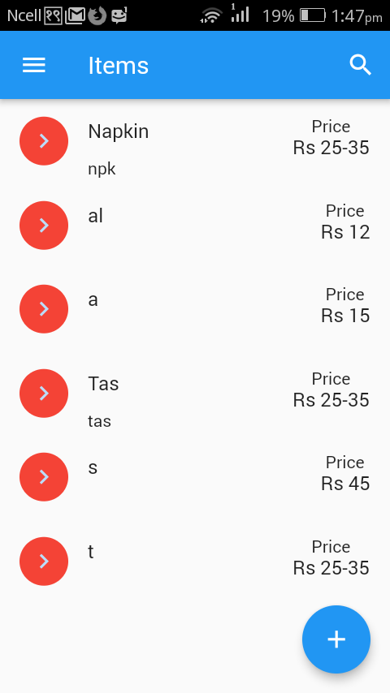 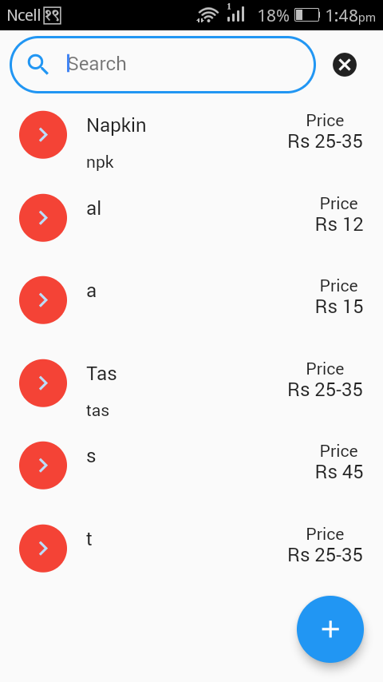 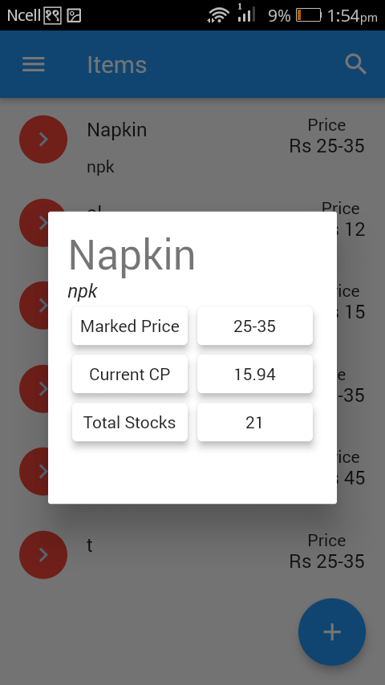
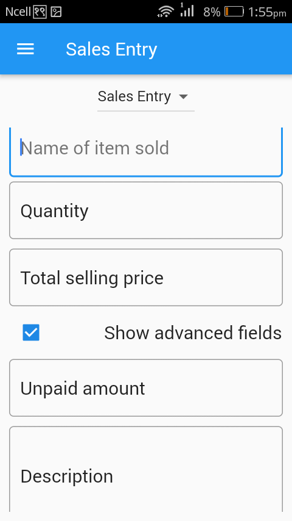  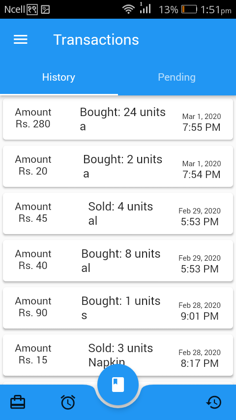
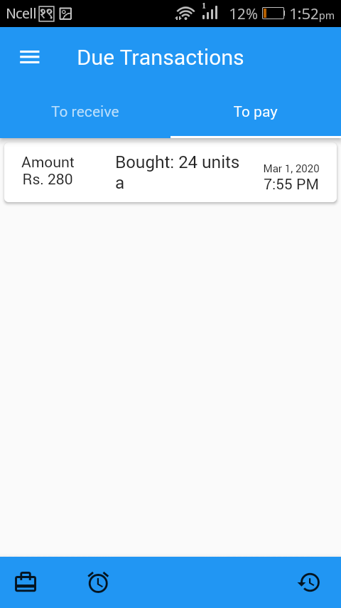 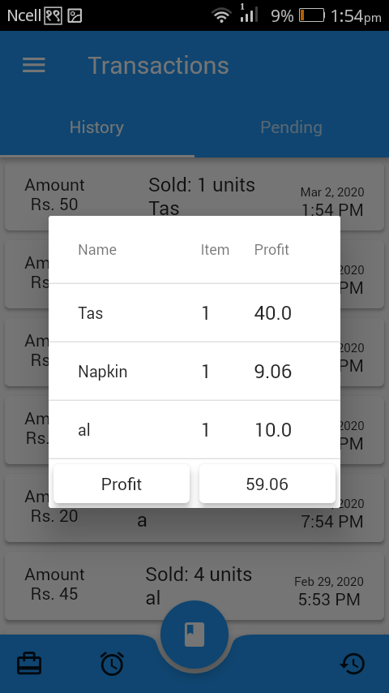 
 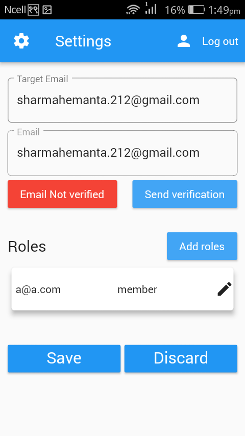 
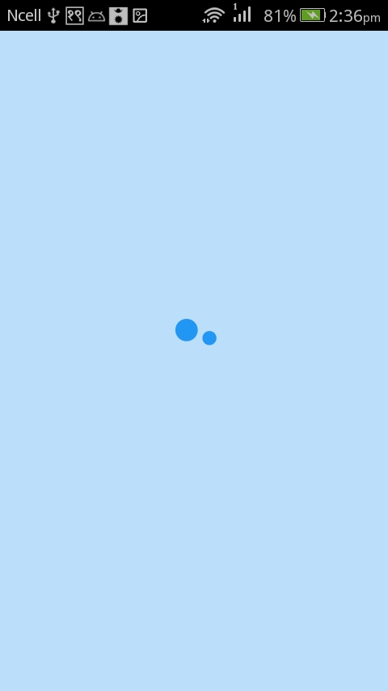
