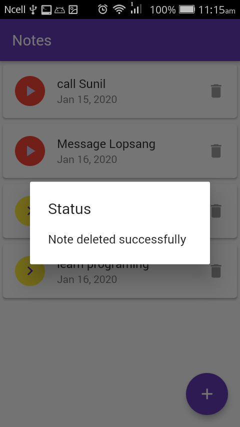
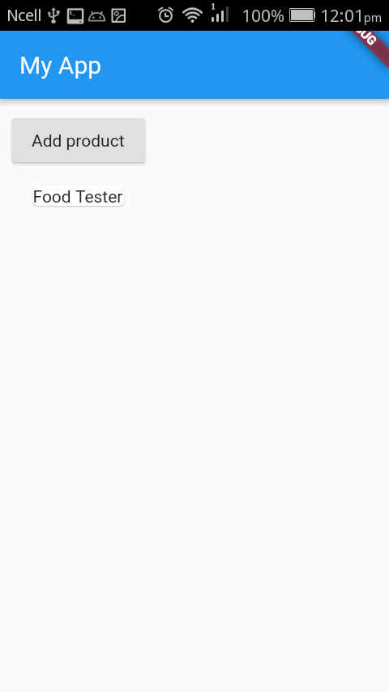

# Learn Flutter

website: https://flutter.dev
docs: https://flutter.dev/docs

## Project Installation:
```
$ git clone https://github.com/hemanta212/hello_flutter.git
$ cd hello_flutter
$ flutter upgrade
```

There are many projects navigate to one and run.
```
$ flutter pub get
$ flutter clean
$ flutter run
```


## A flutter Notekeeping app
It covers..
* Async/Await in flutter
* Sqflite database
* Basic material UI using stateful & stateless widgets





## Other Projects:
1. Hello world in flutter


2. Lucky no generator


3. Food tester (incomplete)



4. Simple interest calculator


