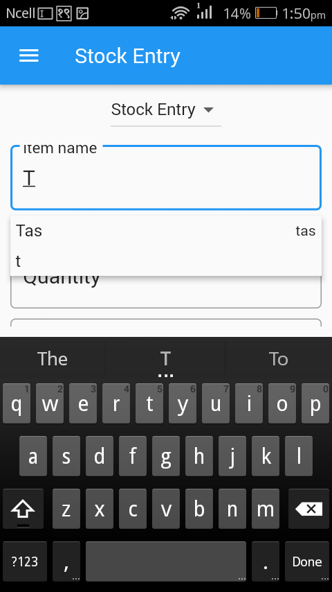
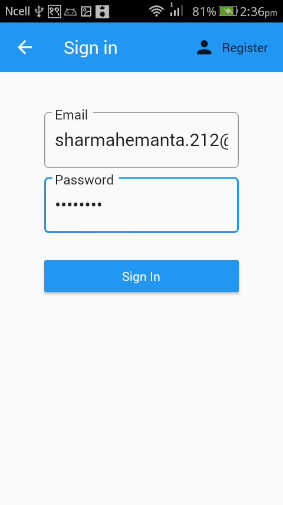
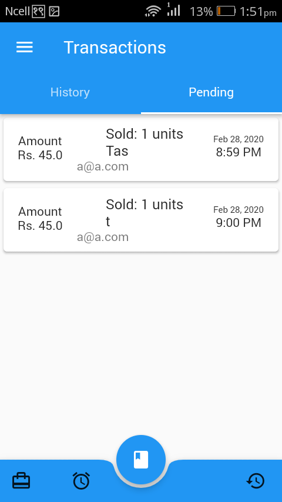

# Learn Flutter
website: https://flutter.dev
docs: https://flutter.dev/docs


## Project Installation:
### 1. Building yourself

#### First Install flutter : [Flutter Installation](https://flutter.dev/docs/get-started/install)
```
$ git clone https://github.com/hemanta212/hello_flutter.git
$ cd hello_flutter
$ flutter upgrade
```

#### For each project you can navigate to folder and run
```
$ flutter pub get
$ flutter run
```

### 2. Install and try out apks!
Head over to the release page to try out the apps.
[APK Releases](https://github.com/hemanta212/hello_flutter/releases/tag/v0.0.2)

## Projects: (ORDER: Beginner ---> Advanced)
1. [Hello world](#hello) [Beginner]
2. [Lucky Number Generator](#lucky) [Beginner]
3. [Simple Interest Calculator](#si) [Beginner-Intermediate]
4. [Note Keeping Application](#notes) [Beginner-Advanced]
5. [Bookkeeping & Inventory Management App](#bk_app) [Intermediate]


### Hello world app in flutter <a id='hello'></a>
<table>
  <tr>
    <td>Hello world in flutter</td>
     <td>Increment counter</td>
  </tr>
  <tr>
    <td></td>
    <td></td>
  </tr>
 </table>

### Lucky no generator <a id='lucky'></a>
<table>
  <tr>
    <td>Generate & display random number</td>
  </tr>
  <tr>
    <td></td>
  </tr>
 </table>

### Simple interest calculator <a id='si'></a>
* Basic state management
* Connecting Dart logic and UI
* Basic Designing and Layout of Widgets
* Forms (input, validation, processing)

<table>
  <tr>
    <td>Input Forms</td>
     <td>Calculation and Result Display</td>
  </tr>
  <tr>
    <td></td>
    <td></td>
  </tr>
</table>
 
## A flutter Notekeeping app <a id='notes'></a>
* OOP concepts (Classes, named constructors, singletons)
* Async/Await (Asynchronous processes) in dart/flutter
* Sqflite db for CRUD operation, Intl for date formats & path_provider for accessing app data dirs in platform independent way
* Widgets like ListView builder, snackbar, alertDialogs, Icons, Cards, GestureDetector
* Passing of context data, Navigation between screens

<table>
  <tr>
    <td>Notes List Page</td>
     <td>New note creation</td>
     <td>Save and update</td>
  </tr>
  <tr>
    <td></td>
    <td></td>
    <td></td>
  </tr>
 </table>
 
## Bookkeeping and Inventory Management App <a id='bk_app'></a> [Download APK](https://github.com/hemanta212/hello_flutter/releases/latest)
* Advanced state management solutions like provider,
* Use of singleton objects for caching and accessing the instance throughout the code.
* Implementation of Navigation Drawers, tabs, search bars, autocompletion and fuzzy like search algorithms.
* Use of Streams for live UI updates, Datatables for better data view, routes for screens.
* Using batches for failproof db operations, Role base db modifications.
* Testing in flutter application.
* Data Export/Import from CSV dumps.
* Online and Offline No SQL data storage with firebase's cloud_firestore.
* Integration of Authentication like google signin, email authentication with firebase_auth.
* Continuous integration for streamlined devflow.

<table>
  <tr>
    <td>Items List Page</td>
     <td>Search through items</td>
     <td>General information</td>
  </tr>
  <tr>
    <td></td>
    <td></td>
    <td></td>
  </tr>

  <tr>
    <td>Entering New items</td>
     <td>Simple sales form</td>
     <td>Auto complete as you type</td>
  </tr>
  <tr>
    <td></td>
    <td></td>
    <td></td>
  </tr>

  <tr>
    <td>Supports custom units</td>
     <td>View recent transaction</td>
     <td>Unpaid/Due transactions reminder</td>
  </tr>
  <tr>
    <td></td>
    <td></td>
    <td></td>
  </tr>

  <tr>
    <td>View sales overview for current day</td>
     <td>Extra info about sales transactions</td>
     <td>Daily sales summary for current month</td>
  </tr>
  <tr>
    <td></td>
    <td></td>
    <td></td>
  </tr>

  <tr>
    <td>Login or register screen</td>
     <td>Subscribe to other's data or authorize your own employees with roles</td>
     <td>Approve/Reject transactions created by employees</td>
  </tr>
  <tr>
    <td></td>
    <td></td>
    <td></td>
  </tr>

  <tr>
    <td>Navigation Drawer</td>
     <td>Beautiful animations</td>
  </tr>
  <tr>
    <td></td>
    <td></td>
  </tr>
</table>
